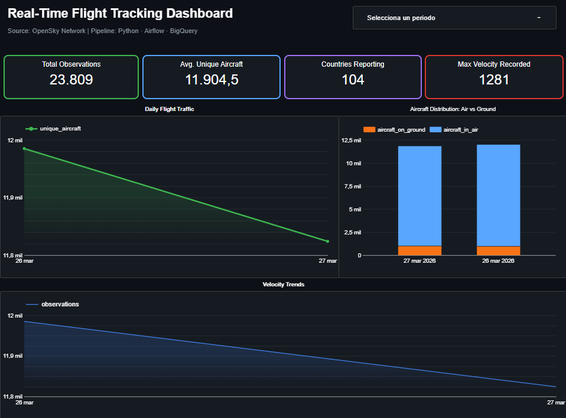

# ✈️ Flight Tracking Data Pipeline on GCP

A data engineering pipeline that ingests real-time flight data from the [OpenSky Network API](https://opensky-network.org/), processes it through multiple data layers, and loads it into **BigQuery** for analysis and visualization via **Looker Studio**.

Built with **Python**, **Apache Airflow**, and **Google BigQuery**.

---

## 📌 Overview

This project captures a daily snapshot of global flight activity, transforms the data through a layered architecture, and serves it through analytical views for dashboard consumption. The pipeline runs on a local Airflow instance and loads data into Google Cloud's BigQuery.

---

## 🏗️ Architecture

```
OpenSky API
    │
    ▼
[Extract] ── Python script fetches flight states
    │
    ├──► data/raw/        (JSON snapshots)
    │       │
    │       ▼
    │    BigQuery: raw_flights_api
    │
    ▼
[Transform] ── Normalize + clean
    │
    ├──► data/processed/  (NDJSON files)
    │
    ▼
[Load] ── Batch insert into BigQuery
    │
    ├──► BigQuery: stg_flights          (staging - latest snapshot)
    ├──► BigQuery: fact_flight_observations  (historical - append only)
    │
    ▼
[Analytical Views]
    │
    ├──► vw_daily_summary
    ├──► vw_flight_status_daily
    ├──► vw_country_daily
    │
    ▼
Looker Studio Dashboard
```

---

## 📊 Data Model

### Raw Layer

| Table | Description |
|-------|-------------|
| `raw_flights_api` | One row per API request. Stores the full JSON payload for traceability and auditing. |

### Staging Layer

| Table | Description |
|-------|-------------|
| `stg_flights` | Latest snapshot of flight states. Partitioned by `ingestion_timestamp`. Each row represents a single aircraft observation. |

### Fact Layer

| Table | Description |
|-------|-------------|
| `fact_flight_observations` | Historical table where all observations are appended. Partitioned by `ingestion_timestamp`. Source for all analytical views. |

### Analytical Views

| View | Granularity | Description |
|------|-------------|-------------|
| `vw_daily_summary` | Per day | Aggregated daily metrics: unique aircraft, observations, velocity stats, air vs ground counts. |
| `vw_flight_status_daily` | Per day + status | Aircraft count split by flight status (In Air / On Ground). |
| `vw_country_daily` | Per day + country | Breakdown by origin country: unique aircraft, active in air, average velocity. |

> **Note:** Velocity metrics (`avg_velocity`, `max_velocity`) are filtered to exclude aircraft on the ground, ensuring accurate in-flight speed calculations.

---

## 🛠️ Tech Stack

| Tool | Purpose |
|------|---------|
| **Python** | Data extraction, transformation, and loading scripts |
| **Apache Airflow** | Pipeline orchestration (local deployment) |
| **Google BigQuery** | Data warehouse for all layers |
| **Looker Studio** | Dashboard and data visualization |
| **OpenSky Network API** | Real-time flight tracking data source |
| **Local file system** | Simulates GCS for raw/processed data staging |

---

## 📁 Project Structure

```
Flight-Tracking-Data-Pipeline-on-GCP/
│
├── config/
│   └── settings.py            # Project configuration (paths, tables, API settings)
│
├── extract/
│   └── extract_flights.py     # Fetches data from OpenSky API
│
├── transform/
│   └── transform_flights.py   # Cleans and normalizes raw data
│
├── load/
│   └── load_to_bigquery.py    # Loads data into BigQuery (raw, staging, fact)
│
├── checks/
│   └── staging_checks.py      # Data quality validations
│
├── dags/
│   └── flight_pipeline_dag.py # Airflow DAG definition
│
├── start_airflow.sh           # Script to start Airflow locally
├── run_pipeline.py            # Manual pipeline execution script
├── requirements.txt           # Python dependencies
└── README.md
```

---

## 🚀 Getting Started

### Prerequisites

- Python 3.10+
- Google Cloud account with BigQuery enabled
- GCP service account key with BigQuery permissions
- Apache Airflow (local installation)

### Installation

1. **Clone the repository:**
   ```bash
   git clone https://github.com/IgnacioSanchezZeledon/Flight-Tracking-Data-Pipeline-on-GCP.git
   cd Flight-Tracking-Data-Pipeline-on-GCP
   ```

2. **Create a virtual environment and install dependencies:**
   ```bash
   python -m venv venv
   source venv/bin/activate
   pip install -r requirements.txt
   ```

3. **Configure your GCP project:**
   - Update `config/settings.py` with your GCP project ID and dataset name.
   - Set up your service account credentials.

4. **Create BigQuery tables:**
   Run the following DDL in BigQuery to set up the required tables:
   ```sql
   -- Raw layer
   CREATE TABLE `<project>.<dataset>.raw_flights_api` (
     ingestion_timestamp TIMESTAMP NOT NULL,
     source_timestamp TIMESTAMP,
     raw_payload JSON NOT NULL,
     record_count INTEGER
   );

   -- Staging layer
   CREATE TABLE `<project>.<dataset>.stg_flights` (
     flight_id STRING,
     icao24 STRING,
     callsign STRING,
     origin_country STRING,
     longitude FLOAT64,
     latitude FLOAT64,
     velocity FLOAT64,
     true_track FLOAT64,
     vertical_rate FLOAT64,
     on_ground BOOLEAN,
     source_timestamp TIMESTAMP,
     ingestion_timestamp TIMESTAMP
   ) PARTITION BY DATE(ingestion_timestamp);

   -- Fact layer
   CREATE TABLE `<project>.<dataset>.fact_flight_observations` (
     flight_id STRING NOT NULL,
     ingestion_timestamp TIMESTAMP NOT NULL,
     source_timestamp TIMESTAMP NOT NULL,
     icao24 STRING,
     callsign STRING,
     origin_country STRING,
     longitude FLOAT64,
     latitude FLOAT64,
     velocity FLOAT64,
     true_track FLOAT64,
     vertical_rate FLOAT64,
     on_ground BOOLEAN
   ) PARTITION BY DATE(ingestion_timestamp);
   ```

5. **Create analytical views:**
   ```sql
   CREATE OR REPLACE VIEW `<project>.<dataset>.vw_daily_summary` AS
   SELECT
       DATE(source_timestamp) AS flight_date,
       COUNT(*) AS observations,
       COUNT(DISTINCT icao24) AS unique_aircraft,
       COUNT(DISTINCT origin_country) AS countries_reporting,
       AVG(IF(NOT on_ground, velocity, NULL)) AS avg_velocity,
       MAX(IF(NOT on_ground, velocity, NULL)) AS max_velocity,
       COUNT(DISTINCT IF(NOT on_ground, icao24, NULL)) AS aircraft_in_air,
       COUNT(DISTINCT IF(on_ground, icao24, NULL)) AS aircraft_on_ground
   FROM `<project>.<dataset>.fact_flight_observations`
   GROUP BY flight_date;

   CREATE OR REPLACE VIEW `<project>.<dataset>.vw_flight_status_daily` AS
   SELECT
       DATE(source_timestamp) AS flight_date,
       CASE WHEN on_ground THEN 'On Ground' ELSE 'In Air' END AS flight_status,
       COUNT(DISTINCT icao24) AS aircraft_count
   FROM `<project>.<dataset>.fact_flight_observations`
   GROUP BY flight_date, flight_status;

   CREATE OR REPLACE VIEW `<project>.<dataset>.vw_country_daily` AS
   SELECT
       DATE(source_timestamp) AS flight_date,
       origin_country,
       COUNT(*) AS observations,
       COUNT(DISTINCT icao24) AS unique_aircraft,
       COUNT(DISTINCT IF(NOT on_ground, icao24, NULL)) AS active_aircraft_in_air,
       AVG(IF(NOT on_ground, velocity, NULL)) AS avg_velocity
   FROM `<project>.<dataset>.fact_flight_observations`
   GROUP BY flight_date, origin_country;
   ```

### Running the Pipeline

**Option 1: Manual execution**
```bash
python run_pipeline.py
```

**Option 2: With Airflow**
```bash
./start_airflow.sh
```
Then access the Airflow UI at `http://localhost:8080` and trigger the `flight_pipeline_dag`.

---

## 📈 Dashboard

The data is visualized through a Looker Studio dashboard with three pages:

- **Overview** — Scorecards with key metrics, daily flight traffic trends, aircraft distribution (air vs ground), and velocity trends.
- **Geographic Analysis** — World map of flight activity, top countries by unique aircraft, and a detailed country breakdown table.
- **Flight Status** — Distribution analysis of aircraft in air vs on ground.



👉 [View Dashboard](https://lookerstudio.google.com/reporting/01afa572-abfe-431d-ae87-cf64534a0659)

---

## 🎯 Design Decisions

- **Three-layer architecture** (raw → staging → fact) ensures data traceability and enables reprocessing from any stage.
- **Local file system simulates GCS** to keep costs at zero while maintaining the same pipeline structure.
- **Partitioned tables** in BigQuery optimize query performance and cost.
- **Velocity metrics exclude grounded aircraft** for accurate in-flight speed analysis.
- **Daily ingestion schedule** balances data richness with free-tier resource constraints on GCP.
- **Modular pipeline design** (extract → transform → load) makes each stage independently testable and maintainable.

---

## 📝 License

This project is open source and available for learning and portfolio purposes.
